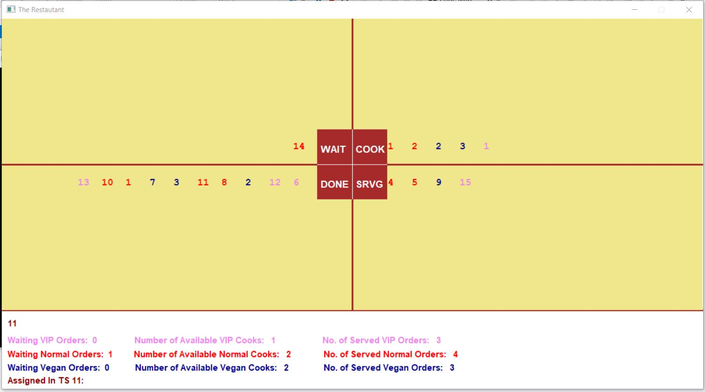

# Restaurant_Simulation_CPP
A full restaurant simulation using C++.
As the name suggests a full restaurant simulation was created using C++ which help imagine real-life scenarios for a restaurant. Order, as well as cooks, are of different types (VIP, Vegan, Normal) allowing for more diversity and more realistic simulation of our real-world life.

